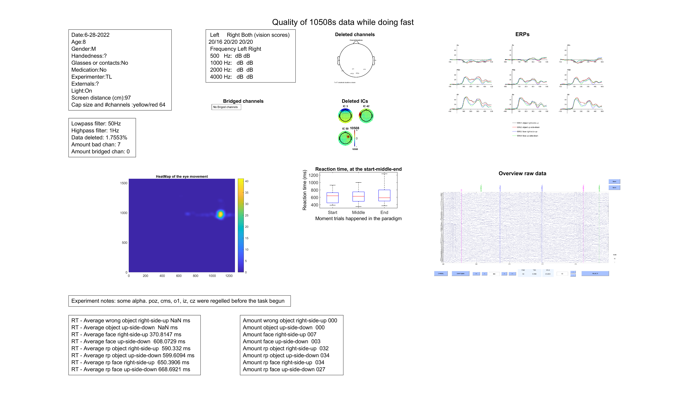

EEG quality analysis pipeline
================
Douwe Horsthuis
2022-08-30

[](https://github.com/DouweHorsthuis/EEG-quality-analysis/graphs/contributors)
[](https://github.com/DouweHorsthuis/EEG-quality-analysis/network/members)
[](https://github.com/DouweHorsthuis/EEG-quality-analysis/stargazers)
[](https://github.com/DouweHorsthuis/EEG-quality-analysis/blob/master/LICENSE.txt)
[](https://www.linkedin.com/in/douwe-horsthuis-725bb9188/)

# EEG quality analysis pipeline

**This EEG pipeline will both pre-process your data and give you a
quality report afterwards that will look somewhat like this:**



Made by [Douwe Horsthuis](https://github.com/DouweHorsthuis/) as part of
the:


**Table of Contents**

1.  [About the project](#about-the-project)  
2.  [The code](#the-code)
    -   [How to download and use the
        code](#how-to-download-and-use-the-code)
    -   [How to prepare the code itself, and other parts for your
        data](#how-to-prepare-the-code-itself-and-other-parts-for-your-data)

## About the project

The goal of this project is to have a reliable EEG pipeline that can be
used in an objective way to show the quality of a data set, while
potentially also pre-processing EEG data. The main difference between
this pipeline and [the one it was based
on](https://github.com/DouweHorsthuis/EEG_to_ERP_pipeline_stats_R/) is
that this one ends with a PDF file that gives you some insight in the
data. [Click here for an example of what it can look
like](images/example_data_quality.pdf). Part of the idea is that this
allows for analysis data as it comes, and tells us if the basics of a
paradigms are working, if the participants responses are accurate, when
eye tracking is used if the participant is looking at the right spot.
The whole pipeline is written in Matlab, and relies on EEGLAB and some
EEGLAB plugins. More in-depth information below.

## The code

### How to download and get the code ready

To download the code you can [click
here](https://github.com/DouweHorsthuis/EEG-quality-analysis/archive/refs/heads/main.zip).
The script you want to use is in the src folder, and you’ll also need
the functions from the same folder.  
To download EEGLAB [go here](https://sccn.ucsd.edu/eeglab/download.php)
and follow the instructions.  
After downloading EEGLAB, you will need to install the ERPlab plugin and
the Biosig plugin. You can find either by **opening EEGLAB**, click on
**file** (left top corner of the gui) and click on **Manage EEGLAB
extensions**.

*AFTER INSTALLING EEGLAB AND THE ERPLAB & BIOSIG PLUGINS*

In MATLAB add the folder with the functions to your path. You can do
this manually by

1.  Clicking **HOME** (left top corner)  
2.  **Set Path** (in the middle of the top panel)  
3.  **Add with Subfolders…**  
4.  Find where you have the function folder, you just downloaded, and
    add it.

### How to prepare the code itself, and other parts for your data

While the idea is that there is very few manual (and potential
subjective) input, you will need to set some parameters.  
**Binlist**  
The first is you need files that will explain what trigger represents
what. We call these binlists. You will need to create 2 binlists. 1 to
plot your ERPS and another to calculate your reaction times (RTs). You
can find and example for each in the testing folder, but for more all
information on how to make one from scratch [see
this](https://github-wiki-see.page/m/lucklab/erplab/wiki/Assigning-Events-to-Bins-with-BINLISTER:-Tutorial).  
**Updating variables inside matlab**  
Line 10 to 42 all relate to information matlab wants from you. The first
part you should set only 1 time and should be the same for each
participant you run for that paradigm.

``` matlab
subject_list = {'id'};% The ID for the particpant
load_path    = ''; %will open individual folders based on subject ID
save_path    = ''; %where will you save the data (something like 'C:\data\')
binlist_location='';%where do you store your data
logo_location= '';%if you want to add a logo you can add it here if not leave it empty
logo_filename=''; %filename + extention (eg.'CNL_logo.jpeg')
binlist_name=''; %name of the text file with your bins
rt_binlist = ''; %name of the reaction time binlist
rt_plot_n=; %which RT bins do you want to plot together (can only plot one group)
plotting_bins=; %the bins that should become ERPs
channels_names={}; %channels that you want plots for (
colors={}; %define colors of your ERPs (1 per bin), add - for solid line add -- for dashed line -. for dotted/dashed : for dotted
downsample_to=; % what is the sample rate you want to downsample to
lowpass_filter_hz=; %50hz filter
highpass_filter_hz=; %1hz filter
epoch_time = [];
baseline_time = [];
```

In the testing folder you can see an example where it is all filled out.
It will all look something like this (of course with changes that will
work for where you have your data and how you named it etc.)

``` matlab
subject_list = {'10508'};% The ID for the particpant
load_path    = 'C:\Users\dohorsth\Desktop\SFARI Behav\FAST\Data\'; %will open individual folders based on subject ID
save_path    = 'C:\Users\dohorsth\Desktop\SFARI Behav\FAST\test\'; %where will you save the data (something like 'C:\data\')
binlist_location='C:\Users\dohorsth\Desktop\SFARI Behav\FAST\script\';
logo_location= 'C:\Users\dohorsth\Documents\GitHub\EEG-quality-analysis\images\';%if you want to add a logo you can add it here if not leave it empty
logo_filename='CNL_logo.jpeg'; %filename + extention (eg.'CNL_logo.jpeg')
binlist_name='binlist_fast_simple.txt'; %name of the text file with your bins
rt_binlist = 'binlist_fast_rt.txt'; %name of the reaction time binlist
rt_plot_n=1:4; %which RT bins do you want to plot together (can only plot one group)
plotting_bins=1:4; %the bins that should become ERPs
channels_names={'Cz' 'Pz' 'CPz' 'Po3' 'Poz' 'po4' 'o1' 'oz' 'o2'}; %channels that you want plots for (
colors={'k-' , 'r-' , 'b-' ,'g-' }; %define colors of your ERPs (1 per bin), add - for solid line add -- for dashed line -. for dotted/dashed : for dotted
downsample_to=256; % what is the sample rate you want to downsample to
lowpass_filter_hz=50; %50hz filter
highpass_filter_hz=1; %1hz filter
epoch_time = [-100 500];
baseline_time = [-50 0];
```

This script expect that your bdf files are organized in one folder per
paradigm with sub folder for each participant. Which looks something
like this:

\[Paradigm name\]  
├── \[IDparticipant1\] \# folder of the first participant  
├── \[IDparticipant2\] \# folder of the second participant  
: :  
└── \[IDparticipantn\] \# folder of participant n

In line 68 and 69 it will update the loading and saving place for each
individual subject.
